# 🚀 50 Days of Data Structures & Algorithms (DSA) Challenge

Welcome to the **50-Day DSA Mastery Repository**! This structured 50-day roadmap is designed to build a deep intuition for solving LeetCode/Coding Interview problems by mastering **26 Core Algorithmic Patterns**.

---

## 📊 Challenge Overview & Progress Tracker

- 🎯 **Total Target Days**: 50 Days
- 🧩 **Core Patterns Covered**: 26 Algorithmic Patterns
- 📝 **Target Problem Count**: ~196 Problems
- 🔄 **Review & Revision Milestones**: Days 7, 14, 21, 28, 35, 42, 49, 50

---

## 📅 50-Day Roadmap Matrix

| Day | Focus Patterns Covered | Target Problems | Folder Link | Status |
| :---: | :--- | :---: | :---: | :---: |
| **Day 01** | Two Pointers | **5** | [`/Day 01`](./Day 01) | ✅ Completed |
| **Day 02** | Two Pointers | **5** | [`/Day 02`](./Day 02) | ✅ Completed |
| **Day 03** | Two Pointers, Fast & Slow Pointers | **5** | [`/Day 03`](./Day 03) | ✅ Completed |
| **Day 04** | Fast & Slow Pointers, Sliding Window | **5** | [`/Day 04`](./Day 04) | ✅ Completed |
| **Day 05** | Sliding Window | **4** | [`/Day 05`](./Day 05) | ⏳ Pending |
| **Day 06** | Sliding Window | **4** | [`/Day 06`](./Day 06) | ⏳ Pending |
| **Day 07** | Review & Revision | **3** | [`/Day 07`](./Day 07) | 🔄 Review |
| **Day 08** | Sliding Window, Merge Intervals | **4** | [`/Day 08`](./Day 08) | ⏳ Pending |
| **Day 09** | Merge Intervals | **4** | [`/Day 09`](./Day 09) | ⏳ Pending |
| **Day 10** | Cyclic Sort | **4** | [`/Day 10`](./Day 10) | ⏳ Pending |
| **Day 11** | Cyclic Sort | **4** | [`/Day 11`](./Day 11) | ⏳ Pending |
| **Day 12** | In-place Reversal of a LinkedList | **4** | [`/Day 12`](./Day 12) | ⏳ Pending |
| **Day 13** | In-place Reversal of a LinkedList, Stack | **4** | [`/Day 13`](./Day 13) | ⏳ Pending |
| **Day 14** | Review & Revision | **3** | [`/Day 14`](./Day 14) | 🔄 Review |
| **Day 15** | Stack, Monotonic Stack | **4** | [`/Day 15`](./Day 15) | ⏳ Pending |
| **Day 16** | Monotonic Stack | **4** | [`/Day 16`](./Day 16) | ⏳ Pending |
| **Day 17** | Monotonic Stack, Hash Maps | **4** | [`/Day 17`](./Day 17) | ⏳ Pending |
| **Day 18** | Hash Maps | **4** | [`/Day 18`](./Day 18) | ⏳ Pending |
| **Day 19** | Hash Maps, Tree Breadth First Search | **4** | [`/Day 19`](./Day 19) | ⏳ Pending |
| **Day 20** | Tree Breadth First Search | **4** | [`/Day 20`](./Day 20) | ⏳ Pending |
| **Day 21** | Review & Revision | **3** | [`/Day 21`](./Day 21) | 🔄 Review |
| **Day 22** | Tree Breadth First Search, Tree Depth First Search | **4** | [`/Day 22`](./Day 22) | ⏳ Pending |
| **Day 23** | Tree Depth First Search | **4** | [`/Day 23`](./Day 23) | ⏳ Pending |
| **Day 24** | Graphs | **4** | [`/Day 24`](./Day 24) | ⏳ Pending |
| **Day 25** | Graphs, Island (Matrix Traversal) | **4** | [`/Day 25`](./Day 25) | ⏳ Pending |
| **Day 26** | Island (Matrix Traversal), Two Heaps | **4** | [`/Day 26`](./Day 26) | ⏳ Pending |
| **Day 27** | Two Heaps, Subsets | **4** | [`/Day 27`](./Day 27) | ⏳ Pending |
| **Day 28** | Review & Revision | **3** | [`/Day 28`](./Day 28) | 🔄 Review |
| **Day 29** | Subsets, Modified Binary Search | **4** | [`/Day 29`](./Day 29) | ⏳ Pending |
| **Day 30** | Modified Binary Search | **4** | [`/Day 30`](./Day 30) | ⏳ Pending |
| **Day 31** | Modified Binary Search | **4** | [`/Day 31`](./Day 31) | ⏳ Pending |
| **Day 32** | Modified Binary Search | **4** | [`/Day 32`](./Day 32) | ⏳ Pending |
| **Day 33** | Modified Binary Search, Bitwise XOR | **4** | [`/Day 33`](./Day 33) | ⏳ Pending |
| **Day 34** | Bitwise XOR, Top K Elements | **4** | [`/Day 34`](./Day 34) | ⏳ Pending |
| **Day 35** | Review & Revision | **3** | [`/Day 35`](./Day 35) | 🔄 Review |
| **Day 36** | Top K Elements | **4** | [`/Day 36`](./Day 36) | ⏳ Pending |
| **Day 37** | K-way Merge | **4** | [`/Day 37`](./Day 37) | ⏳ Pending |
| **Day 38** | Greedy Algorithms | **4** | [`/Day 38`](./Day 38) | ⏳ Pending |
| **Day 39** | Greedy Algorithms, 0/1 Knapsack (Dynamic Programming) | **4** | [`/Day 39`](./Day 39) | ⏳ Pending |
| **Day 40** | 0/1 Knapsack (Dynamic Programming) | **4** | [`/Day 40`](./Day 40) | ⏳ Pending |
| **Day 41** | Backtracking | **4** | [`/Day 41`](./Day 41) | ⏳ Pending |
| **Day 42** | Review & Revision | **3** | [`/Day 42`](./Day 42) | 🔄 Review |
| **Day 43** | Backtracking, Trie | **4** | [`/Day 43`](./Day 43) | ⏳ Pending |
| **Day 44** | Trie | **4** | [`/Day 44`](./Day 44) | ⏳ Pending |
| **Day 45** | Topological Sort (Graph) | **4** | [`/Day 45`](./Day 45) | ⏳ Pending |
| **Day 46** | Topological Sort (Graph), Union Find | **4** | [`/Day 46`](./Day 46) | ⏳ Pending |
| **Day 47** | Union Find, Ordered Set & Misc | **4** | [`/Day 47`](./Day 47) | ⏳ Pending |
| **Day 48** | Ordered Set & Misc | **4** | [`/Day 48`](./Day 48) | ⏳ Pending |
| **Day 49** | Review & Revision | **3** | [`/Day 49`](./Day 49) | 🔄 Review |
| **Day 50** | Review & Revision | **3** | [`/Day 50`](./Day 50) | 🔄 Review |


---

# 🧠 Master Guide: 26 Core DSA Coding Patterns

Below is the complete reference guide for all **26 Core Patterns** covered across the 50 days, including visual diagrams, identification signals, and complexity analysis.

### 1. Two Pointers

- 📌 **Concept**: Uses two memory pointers traversing a linear array/string (from ends or same direction) to find pairs, triplets, or partition elements in linear time.
- 🎯 **When to Use**: Sorted arrays/strings, target sum pairs, multi-element matching, container water trapping, palindrome verification.
- ⏱️ **Complexity**: `Time: O(N) | Space: O(1)`
- 💡 **Classic Problems**: Two Sum II, 3Sum, Container With Most Water, Trapping Rain Water, Valid Palindrome

#### Visual Diagram:
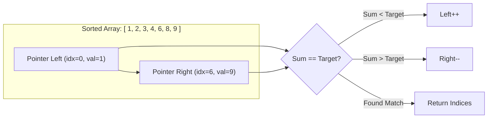

---

### 2. Fast & Slow Pointers (Floyd's Cycle Finding)

- 📌 **Concept**: Uses two pointers traversing at different speeds (slow moves 1 node, fast moves 2 nodes). If a cycle exists, the pointers will eventually meet.
- 🎯 **When to Use**: Linked list cycle detection, finding cycle entry point, finding middle node, happy number sequences.
- ⏱️ **Complexity**: `Time: O(N) | Space: O(1)`
- 💡 **Classic Problems**: Linked List Cycle, Cycle II, Middle of Linked List, Happy Number

#### Visual Diagram:
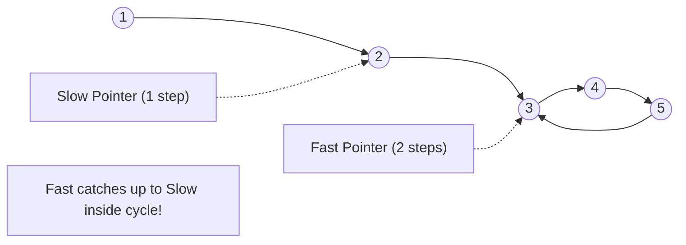

---

### 3. Sliding Window

- 📌 **Concept**: Maintains a subset of contiguous elements over an array/string. The window shrinks or expands dynamically based on target constraints.
- 🎯 **When to Use**: Contiguous subarray/substring, max/min sum subarray of size K, longest substring with K distinct characters.
- ⏱️ **Complexity**: `Time: O(N) | Space: O(1) to O(K)`
- 💡 **Classic Problems**: Maximum Subarray Sum of Size K, Longest Substring Without Repeating Characters, Minimum Window Substring

#### Visual Diagram:
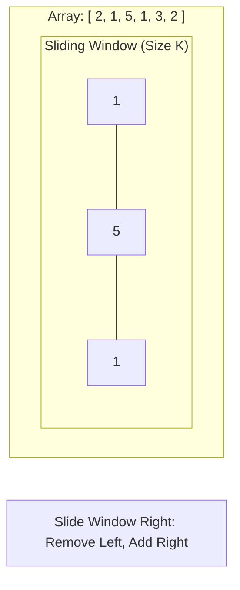

---

### 4. Merge Intervals

- 📌 **Concept**: Deals with overlapping interval pairs by sorting intervals according to their start times and merging overlapping ranges dynamically.
- 🎯 **When to Use**: Overlapping intervals, schedule conflicts, meeting rooms, interval insertions.
- ⏱️ **Complexity**: `Time: O(N log N) | Space: O(N)`
- 💡 **Classic Problems**: Merge Intervals, Insert Interval, Meeting Rooms II, Interval List Intersections

#### Visual Diagram:
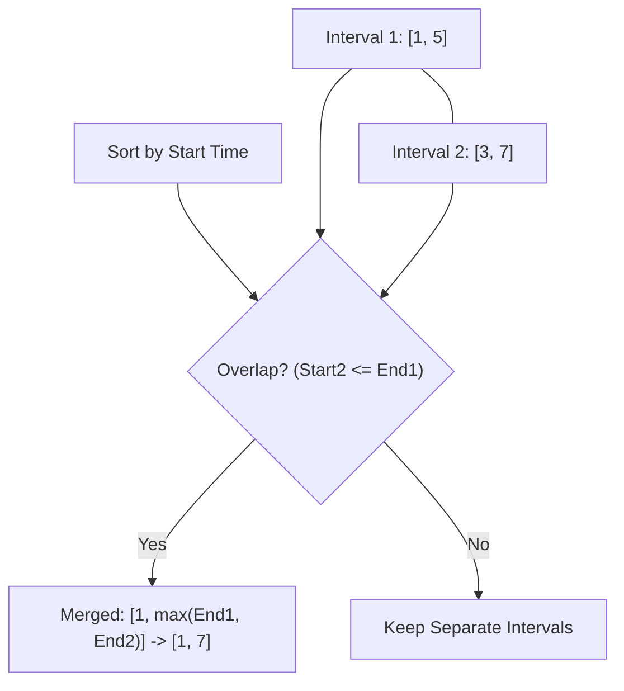

---

### 5. Cyclic Sort

- 📌 **Concept**: Iterates through an array containing values in a known range (e.g. 1 to N). Places each number at its correct index `arr[i] - 1` by swapping.
- 🎯 **When to Use**: Unsorted array with numbers in range 1 to N or 0 to N, finding missing/duplicate/corrupted numbers.
- ⏱️ **Complexity**: `Time: O(N) | Space: O(1)`
- 💡 **Classic Problems**: Find Missing Number, Find All Duplicates, Find First Missing Positive

#### Visual Diagram:
```mermaid
flowchart LR
    Idx0["Index 0: Value 3"] -- Swap with Index 2 --> Idx2["Index 2: Value 1"]
    Idx2 -- Swap with Index 0 --> Idx0 Correct["Index 0: Value 1 (Correct!)"]
```

---

### 6. In-place Reversal of a LinkedList

- 📌 **Concept**: Reverses the link directions between nodes of a Linked List in-place without allocating extra node objects.
- 🎯 **When to Use**: Reverse entire linked list, reverse sub-list from position L to R, k-group reversal.
- ⏱️ **Complexity**: `Time: O(N) | Space: O(1)`
- 💡 **Classic Problems**: Reverse Linked List, Reverse Linked List II, Reverse Nodes in k-Group

#### Visual Diagram:
```mermaid
flowchart LR
    subgraph Original ["Original Order"]
        A((1)) --> B((2)) --> C((3)) --> D((4))
    end
    subgraph Reversed ["In-Place Reversed"]
        A2((1)) <-- B2((2)) <-- C2((3)) <-- D2((4))
    end
```

---

### 7. Stack

- 📌 **Concept**: Employs Last-In-First-Out (LIFO) processing order to track nested elements, matching symbols, or evaluation order.
- 🎯 **When to Use**: Parenthesis matching, string decoding, undo operations, calculator expression parsing.
- ⏱️ **Complexity**: `Time: O(N) | Space: O(N)`
- 💡 **Classic Problems**: Valid Parentheses, Evaluate Reverse Polish Notation, Basic Calculator, Simplify Path

#### Visual Diagram:
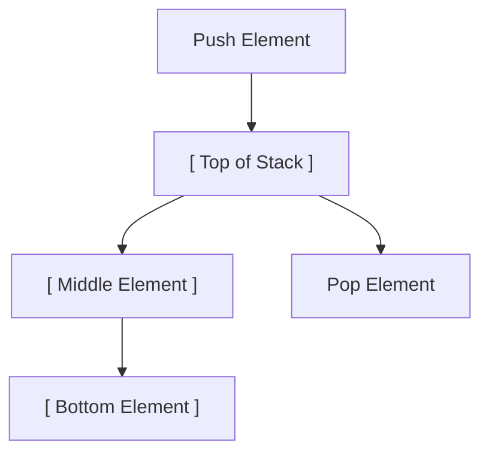

---

### 8. Monotonic Stack

- 📌 **Concept**: Maintains elements in a stack in strictly increasing or decreasing order by popping elements that violate the monotonicity rule.
- 🎯 **When to Use**: Next Greater Element, Previous Smaller Element, daily temperatures, largest rectangle in histogram.
- ⏱️ **Complexity**: `Time: O(N) | Space: O(N)`
- 💡 **Classic Problems**: Next Greater Element I/II, Daily Temperatures, Largest Rectangle in Histogram, Trapping Rain Water

#### Visual Diagram:
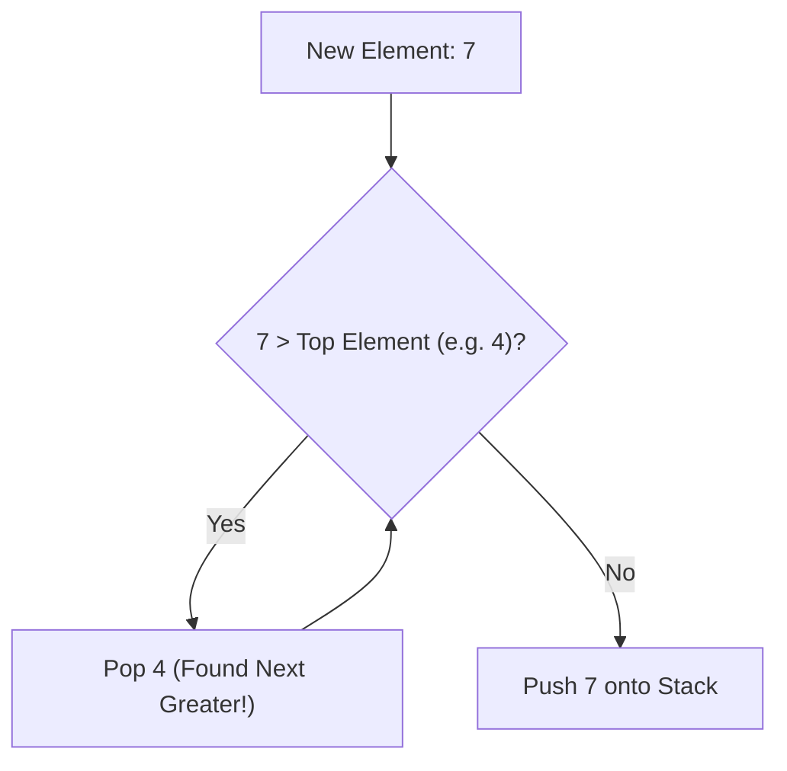

---

### 9. Hash Maps

- 📌 **Concept**: Uses key-value mappings for average O(1) time lookups, insertions, frequency counting, and complement searching.
- 🎯 **When to Use**: Frequency counting, two sum complement search, anagram detection, sub-array sum equals K.
- ⏱️ **Complexity**: `Time: O(N) | Space: O(N)`
- 💡 **Classic Problems**: Two Sum, Group Anagrams, Subarray Sum Equals K, Longest Consecutive Sequence

#### Visual Diagram:
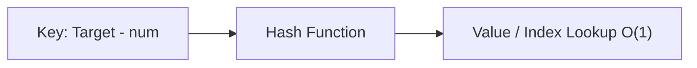

---

### 10. Tree Breadth First Search (BFS)

- 📌 **Concept**: Traverses binary trees level-by-level from top to bottom using a Queue (FIFO) data structure.
- 🎯 **When to Use**: Level order traversal, level averages, minimum depth, connects level order siblings, zig-zag traversal.
- ⏱️ **Complexity**: `Time: O(N) | Space: O(N)`
- 💡 **Classic Problems**: Binary Tree Level Order Traversal, Zigzag Level Order Traversal, Minimum Depth of Binary Tree

#### Visual Diagram:
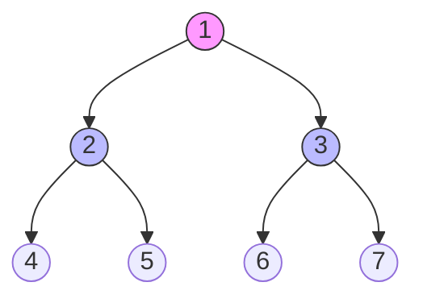

---

### 11. Tree Depth First Search (DFS)

- 📌 **Concept**: Explores as deep as possible along each branch before backtracking. Executed via recursion or explicit call stack.
- 🎯 **When to Use**: Path sum problems, root-to-leaf paths, maximum path sum, subtree validation, tree serialization.
- ⏱️ **Complexity**: `Time: O(N) | Space: O(H) where H is tree height`
- 💡 **Classic Problems**: Path Sum I/II/III, Maximum Path Sum, Lowest Common Ancestor, Invert Binary Tree

#### Visual Diagram:
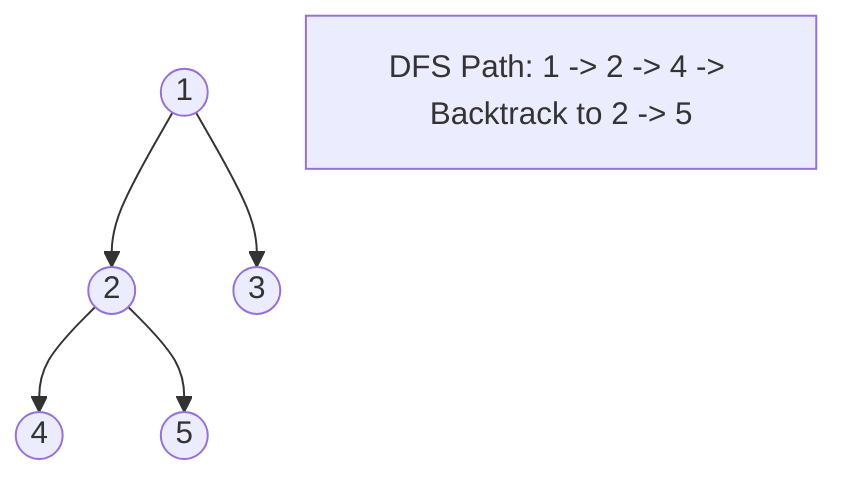

---

### 12. Graphs (BFS / DFS Traversal)

- 📌 **Concept**: Traverses non-linear networks of vertices and edges while maintaining a `visited` set to avoid cycles.
- 🎯 **When to Use**: Network connectivity, shortest path in unweighted graph, bipartite graph checking, clone graph.
- ⏱️ **Complexity**: `Time: O(V + E) | Space: O(V)`
- 💡 **Classic Problems**: Clone Graph, Is Graph Bipartite?, Course Schedule, Shortest Path in Binary Matrix

#### Visual Diagram:
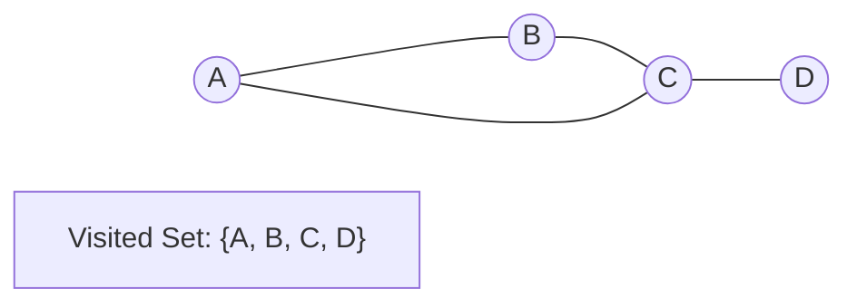

---

### 13. Island (Matrix Traversal)

- 📌 **Concept**: Applies BFS/DFS flood-fill algorithm over a 2D grid matrix to find connected regions/islands of cells.
- 🎯 **When to Use**: Grid traversal, counting islands, perimeter of island, largest island area, flood fill.
- ⏱️ **Complexity**: `Time: O(M * N) | Space: O(M * N)`
- 💡 **Classic Problems**: Number of Islands, Max Area of Island, Pacific Atlantic Water Flow, Surrounded Regions

#### Visual Diagram:
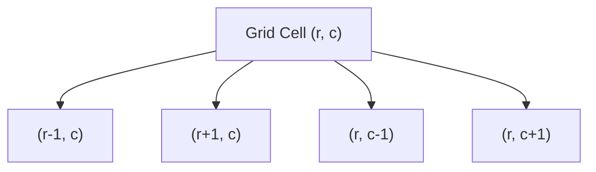

---

### 14. Two Heaps

- 📌 **Concept**: Maintains two heaps: a Max-Heap for the smaller half of data and a Min-Heap for the larger half to easily calculate streaming medians.
- 🎯 **When to Use**: Find median of data stream, sliding window median, dynamic dual-priority tracking.
- ⏱️ **Complexity**: `Time: O(log N) insertion, O(1) median query | Space: O(N)`
- 💡 **Classic Problems**: Find Median from Data Stream, Sliding Window Median, IPO

#### Visual Diagram:
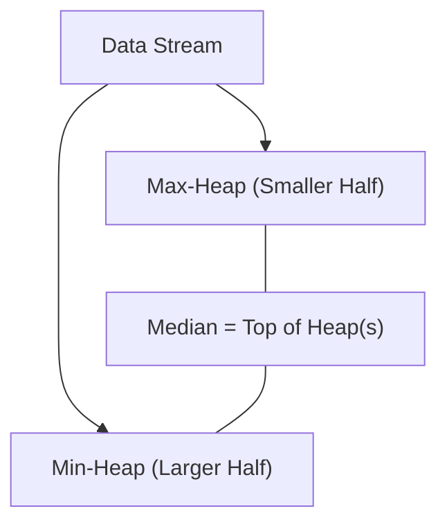

---

### 15. Subsets (Combinatorics & Permutations)

- 📌 **Concept**: Generates all subsets, combinations, or permutations of a set using BFS iterative expansion or DFS backtracking.
- 🎯 **When to Use**: Power set generation, combinations of size K, distinct permutations, letter combinations.
- ⏱️ **Complexity**: `Time: O(2^N) or O(N!) | Space: O(N)`
- 💡 **Classic Problems**: Subsets I/II, Permutations I/II, Letter Combinations of a Phone Number

#### Visual Diagram:
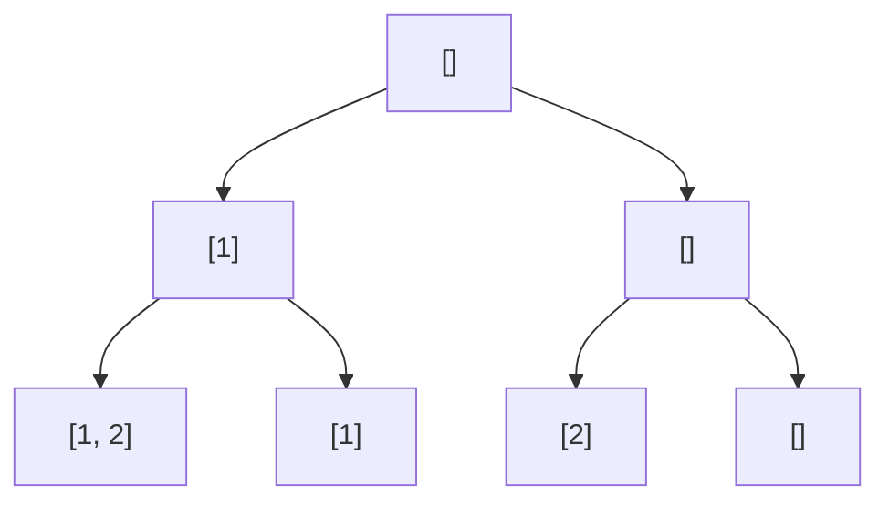

---

### 16. Modified Binary Search

- 📌 **Concept**: Adapts logarithmic divide-and-conquer binary search on sorted, rotated, or bitonic arrays, or searches over solution spaces.
- 🎯 **When to Use**: Search in rotated sorted array, search in bitonic array, search in 2D matrix, search on answer space.
- ⏱️ **Complexity**: `Time: O(log N) | Space: O(1)`
- 💡 **Classic Problems**: Search in Rotated Sorted Array, Find Minimum in Rotated Sorted Array, Kth Smallest in Matrix

#### Visual Diagram:
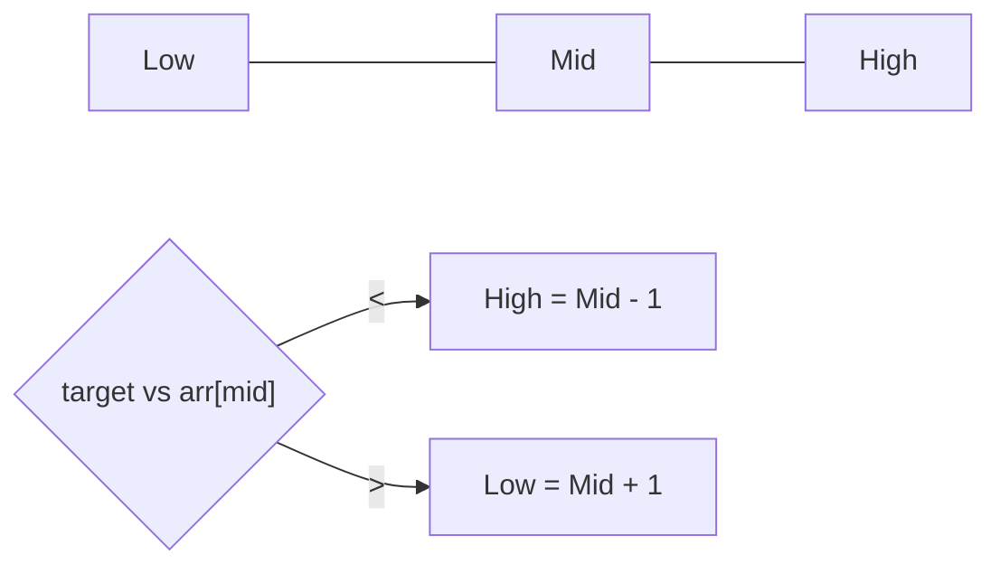

---

### 17. Bitwise XOR

- 📌 **Concept**: Uses XOR properties (A ^ A = 0, A ^ 0 = A) to cancel out duplicate elements or solve bit manipulation challenges without extra space.
- 🎯 **When to Use**: Single Number, two single numbers, missing number, bitwise complement.
- ⏱️ **Complexity**: `Time: O(N) | Space: O(1)`
- 💡 **Classic Problems**: Single Number I/II/III, Missing Number, Subsets via Bitmasking

#### Visual Diagram:
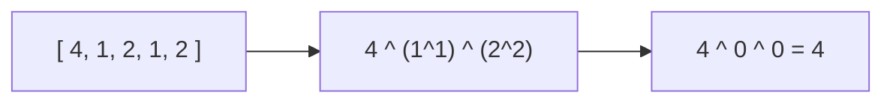

---

### 18. Top K Elements

- 📌 **Concept**: Uses a Min-Heap of size K (for largest elements) or Max-Heap (for smallest elements) to dynamically track the Top K items.
- 🎯 **When to Use**: Kth largest element, Top K frequent words/numbers, K closest points to origin.
- ⏱️ **Complexity**: `Time: O(N log K) | Space: O(K)`
- 💡 **Classic Problems**: Kth Largest Element in an Array, Top K Frequent Elements, K Closest Points to Origin

#### Visual Diagram:
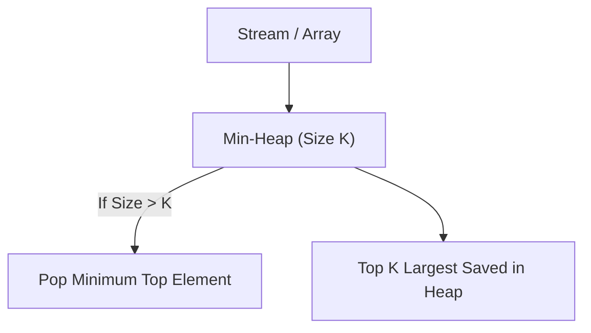

---

### 19. K-way Merge

- 📌 **Concept**: Merges K sorted lists/arrays by maintaining a Min-Heap storing the current smallest element from each list.
- 🎯 **When to Use**: Merge K sorted lists, Kth smallest element in sorted matrix, small range covering elements from K lists.
- ⏱️ **Complexity**: `Time: O(N log K) | Space: O(K)`
- 💡 **Classic Problems**: Merge k Sorted Lists, Kth Smallest Element in a Sorted Matrix, Smallest Range Covering Elements

#### Visual Diagram:
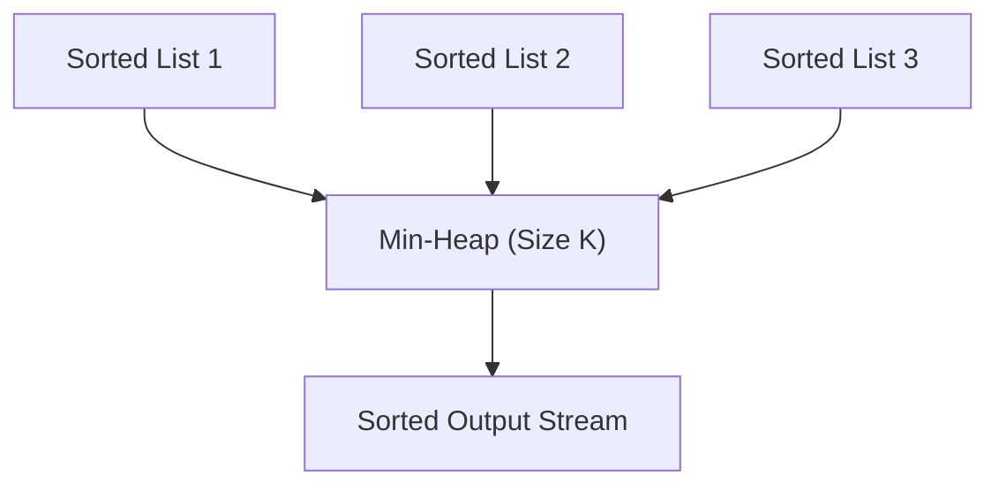

---

### 20. Greedy Algorithms

- 📌 **Concept**: Makes locally optimal choices at each decision step to arrive at a global optimum.
- 🎯 **When to Use**: Jump game, gas station, task scheduler, maximum profit stock trading, interval scheduling.
- ⏱️ **Complexity**: `Time: O(N log N) or O(N) | Space: O(1) to O(N)`
- 💡 **Classic Problems**: Jump Game I/II, Gas Station, Task Scheduler, Best Time to Buy and Sell Stock

#### Visual Diagram:


---

### 21. 0/1 Knapsack (Dynamic Programming)

- 📌 **Concept**: Solves decision problems where items can either be included (1) or excluded (0) under weight/capacity constraints.
- 🎯 **When to Use**: Partition equal subset sum, target sum, knapsack profit maxing, coin change.
- ⏱️ **Complexity**: `Time: O(N * Capacity) | Space: O(Capacity)`
- 💡 **Classic Problems**: 0/1 Knapsack, Partition Equal Subset Sum, Target Sum, Coin Change

#### Visual Diagram:
```mermaid
flowchart TD
    Item["Item i (weight w, val v)"] --> Inc["Include: v + DP[i-1][c - w]"]
    Item --> Exc["Exclude: DP[i-1][c]"]
    Inc & Exc --> Best["DP[i][c] = Max(Include, Exclude)"]
```

---

### 22. Backtracking

- 📌 **Concept**: Systematically builds candidates for solutions using DFS and prunes (backtracks) as soon as a candidate fails constraints.
- 🎯 **When to Use**: N-Queens, Sudoku solver, word search, combination sum, palindrome partitioning.
- ⏱️ **Complexity**: `Time: O(B^D) | Space: O(D) recursion stack`
- 💡 **Classic Problems**: N-Queens, Sudoku Solver, Word Search, Combination Sum I/II

#### Visual Diagram:
```mermaid
flowchart TD
    Root["Choice Point"] --> Valid["Valid Choice -> Recurse Deep"]
    Root --> Invalid["Invalid Choice"] --> Undo["Backtrack (Undo State)"]
```

---

### 23. Trie (Prefix Tree)

- 📌 **Concept**: A tree-like data structure where nodes store characters of keys for extremely efficient string search and prefix queries.
- 🎯 **When to Use**: Autocomplete, prefix matching, word dictionary search, spell checker, word search II.
- ⏱️ **Complexity**: `Time: O(L) insert/search where L is word length | Space: O(N * L)`
- 💡 **Classic Problems**: Implement Trie (Prefix Tree), Design Add and Search Words Data Structure, Word Search II

#### Visual Diagram:
```mermaid
flowchart TD
    Root((Root)) --> C_c((c))
    C_c --> C_a((a))
    C_a --> C_t((t - end))
    C_a --> C_r((r - end))
```

---

### 24. Topological Sort (Graph)

- 📌 **Concept**: Orders vertices of a Directed Acyclic Graph (DAG) linearly such that for every directed edge u -> v, u precedes v.
- 🎯 **When to Use**: Course prerequisites, build order dependency, compilation order, cycle detection in directed graphs.
- ⏱️ **Complexity**: `Time: O(V + E) | Space: O(V + E)`
- 💡 **Classic Problems**: Course Schedule I/II, Alien Dictionary, Minimum Height Trees

#### Visual Diagram:
```mermaid
flowchart LR
    A["Course A (In-degree=0)"] --> B["Course B"]
    C["Course C (In-degree=0)"] --> B
    B --> D["Course D"]
```

---

### 25. Union Find (Disjoint Set Union - DSU)

- 📌 **Concept**: Manages partitioned elements across dynamic disjoint sets supporting `find` (with path compression) and `union` (by rank).
- 🎯 **When to Use**: Connected components in undirected graphs, redundant connection cycle detection, Kruskal's MST.
- ⏱️ **Complexity**: `Time: O(α(N)) amortized nearly O(1) | Space: O(N)`
- 💡 **Classic Problems**: Number of Connected Components, Redundant Connection, Accounts Merge

#### Visual Diagram:
```mermaid
flowchart TD
    RootA((Root 1)) <-- Path Compress -- Node2((Node 2))
    RootA <-- Path Compress -- Node3((Node 3))
    RootB((Root 4)) <-- Union --> RootA
```

---

### 26. Ordered Set & Misc (Sweep-Line / BST)

- 📌 **Concept**: Uses self-balancing search trees (`std::set`, `TreeSet`) or sweep-line algorithms with event queues for dynamic range lookups.
- 🎯 **When to Use**: My Calendar I/II, Sweep-line interval queries, sliding window maximum with BST.
- ⏱️ **Complexity**: `Time: O(N log N) | Space: O(N)`
- 💡 **Classic Problems**: My Calendar I/II, Contains Duplicate III, Meeting Rooms III, Data Stream as Disjoint Intervals

#### Visual Diagram:
```mermaid
flowchart LR
    Events["Sorted Event Points (Time/Coord)"] --> SweepLine["Sweep Line Processing"] --> Active["Active State Set (TreeSet)"]
```

---

## 📁 Folder & File Structure

```text
DSA-50-Days-Challenge/
├── README.md               # Master Roadmap & Pattern Guide (This file)
├── Day 01/                 # Day 01: Two Pointers
│   ├── README.md           # Problem checklist & daily notes
│   ├── 15. 3Sum.cpp        # Code implementations
│   └── ...
├── Day 02/                 # Day 02: Two Pointers
├── ...
└── Day 50/                 # Day 50: Final Review & Revision
```

---

## 💡 How to Use This Repository

1. **Daily Practice**: Open the folder for the current day (e.g., `Day 01`).
2. **Review Checklist**: Read the target patterns in `Day XX/README.md` and attempt the target problems.
3. **Write Code**: Save your solution files (C++, Java, Python, JavaScript, etc.) inside the respective `Day XX/` folder.
4. **Log Insights**: Document edge cases, tricky conditions, and time/space complexities in the day's `README.md`.
5. **Periodic Revision**: Utilize the designated **Review Days** (Days 7, 14, 21, 28, 35, 42, 49, 50) to re-attempt flagged problems.

Happy Coding & Good Luck on your 50-Day DSA Journey! 🚀
